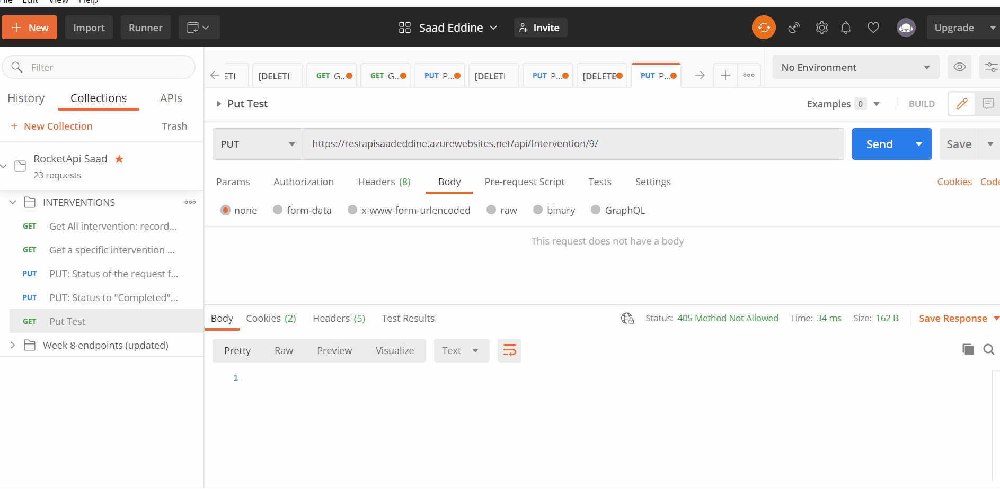

<h1 align="center"> Rocket Elevators REST API: Week 11: Understanding the .NET Framework </h1>

Adding 5 new endpoints to serve the costumer portal requests.

REST API using C # and .NET Core allow requesting Rocket Elevators systems to access and manipulate textual representations of web resources through a set of stateless, predefined uniform operations.

The API from week 8 is enhanced to offer data through new interaction points:
GET: Returns all fields of all Service Request records that do not have a start date and are in "Pending" status.
GET: Returns a specific intervention identified by id.
PUT: Change the status of the intervention request to "InProgress" and add a start date and time (Timestamp).
PUT: Change the status of the request for action to "Completed" and add an end date and time (Timestamp).

> **[Saad eddine](https://github.com/saadeddinne)**

# API Endpoints

Below are described the REST endpoints available that you can use to connect Rocket Elevators information system to the equipment in operation throughout the territory served.

## Link to Postman collection

**[Postman collection](https://www.getpostman.com/collections/399409a80ad03f3b9447)**

## Week 11 new endpoints (costumer portal):

```ssh
https://restapisaadeddine.azurewebsites.net/api/Batteries/{email}/costumer
https://restapisaadeddine.azurewebsites.net/api/Columns/{email}/column
https://restapisaadeddine.azurewebsites.net/api/Elevators/{email}/elevator
https://restapisaadeddine.azurewebsites.net/api/BuildingsOff/{email}/buildings
https://restapisaadeddine.azurewebsites.net/api/Adresses/{email}/address
```

<hr>
How to add the postman collection
<hr>


## Interventions Endpoints

### GET : All intervention: records that do not have a start date and are in "Pending" status.

```ssh
https://restapisaadeddine.azurewebsites.net/api/Intervention
```

### GET: a specific intervention by ID

EXAMPLE: ID = 3

```ssh
https://restapisaadeddine.azurewebsites.net/api/Intervention/3
```

### PUT: "InProgress".

Change the status of the intervention request to "InProgress" and add a start date and time (Timestamp).</br>

#### How to use:

- Please keep the body of request none (no need for the body just id and action: inprogress) in the bar adress.

```ssh
https://restapisaadeddine.azurewebsites.net/api/Intervention/3/inprogress
```

### PUT: "Completed".

Change the status of the intervention request to "Completed" and add a end date and time (Timestamp).</br>

#### How to use:

- Please keep the body of request none (no need for the body just id and action: inprogress) in the bar adress.

```ssh
https://restapisaadeddine.azurewebsites.net/api/Intervention/3/completed
```

The intervention endpoints check and handle :

> ID in the route and return a message if something wrong
> Return message if no data correspond to the request
> Check if the previous status is already modified else update the database
> Test and specify the status (inprogress or completed) in the route and check the previous status in the databse
> Timestamp are with the local area date and time

<hr>
## Preview of use:
<hr>



## Battery

### All

```html
https://restapisaadeddine.azurewebsites.net/api/Batteries
```

### Retrieving a specific Battery: Search by id.

```html
https://restapisaadeddine.azurewebsites.net/api/Batteries/{id}
```

### Retrieving the current status of a specific Battery

```html
https://restapisaadeddine.azurewebsites.net/api/Batteries/{id}/status
```

### Changing the status of a specific Battery (PUT request)

```html
https://restapisaadeddine.azurewebsites.net/api/Batteries/{id}/status
```

### Delete a specific Battery (Delete request)

```html
https://restapisaadeddine.azurewebsites.net/api/Batteries/{id}
```

<hr>

## Column

### All

```html
https://restapisaadeddine.azurewebsites.net/api/Columns/
```

### Retrieving a specific Column: Search by id.

```html
https://restapisaadeddine.azurewebsites.net/api/Columns/{id}
```

### Retrieving the current status of a specific Column

```html
https://restapisaadeddine.azurewebsites.net/api/Columns/{id}/status
```

### Changing the status of a specific Column (PUT request)

```html
https://restapisaadeddine.azurewebsites.net/api/Columns/{id}/status
```

### Delete a specific Battery (Delete request)

```html
https://restapisaadeddine.azurewebsites.net/api/Columns/{id}
```

<hr>

## Elevator

### All

```html
https://restapisaadeddine.azurewebsites.net/api/Elevators/
```

### Retrieving a specific Elevator: Search by id.

```html
https://restapisaadeddine.azurewebsites.net/api/Elevators/{id}
```

### Retrieving the current status of a specific Elevator

```html
https://restapisaadeddine.azurewebsites.net/api/Elevators/{id}/status
```

### Changing the status of a specific Elevator (PUT request)

```html
https://restapisaadeddine.azurewebsites.net/api/Elevators/{id}/status
```

### Retrieving a list of Elevators that are not in operation at the time of the request

```html
https://restapisaadeddine.azurewebsites.net/api/ElevatorsOff
```

### Delete a specific Elevator (Delete request)

```html
https://restapisaadeddine.azurewebsites.net/api/Elevators/{id}
```

<hr>

## Building

### Retrieving a list of Buildings that contain at least one battery, column or elevator requiring intervention

```html
https://restapisaadeddine.azurewebsites.net/api/BuildingsOff
```

<hr>

## Leads

### Retrieving a list of Leads created in the last 30 days who have not yet become customers.

```html
https://restapisaadeddine.azurewebsites.net/api/NotCostumers
```

<hr>

## Response Example

```html
https://restapisaadeddine.azurewebsites.net/api/Elevators/3
```

```json
[
	{
		"id": 3,
		"columnId": 1,
		"serialNumber": "000-86-8653",
		"elevatorModel": "Elevatroma",
		"elevatorType": "Commercial",
		"elevatorStatus": "Intervention",
		"dateOfCommissioning": "2018-07-13T00:00:00",
		"dateOfLastInspection": "2019-03-15T00:00:00",
		"certificateOfInspection": "General",
		"information": "Quos ullam sit vero aut voluptatem aut sunt.",
		"notes": "Quas nihil vitae praesentium porro eaque maxime.",
		"createdAt": "2018-11-26T17:41:43",
		"updatedAt": "2020-11-02T17:59:44"
	}
]
```

## License

- This project is under license from CodeBoxx.

<h6 align="center">Made with ❤️ in Quebec By Saad eddine</h6>

&#xa0;

<a href="#top">Back to top</a>
